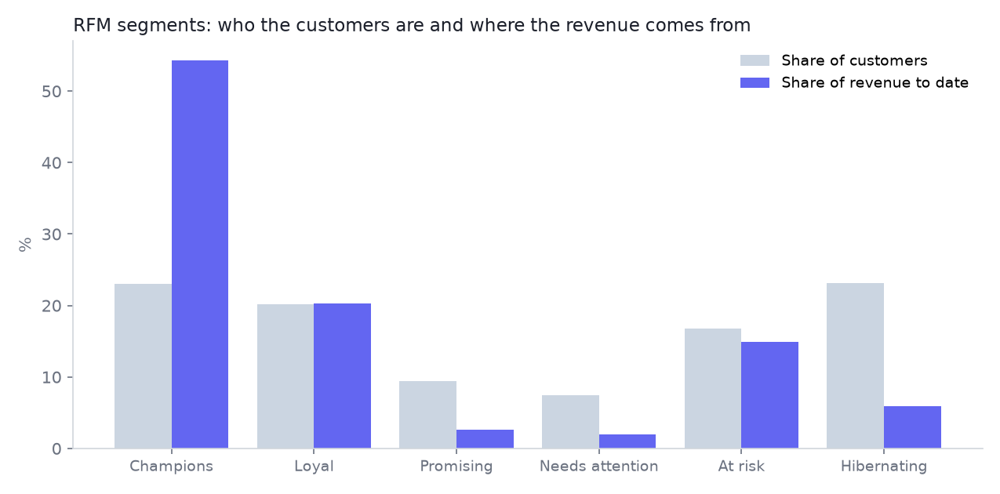
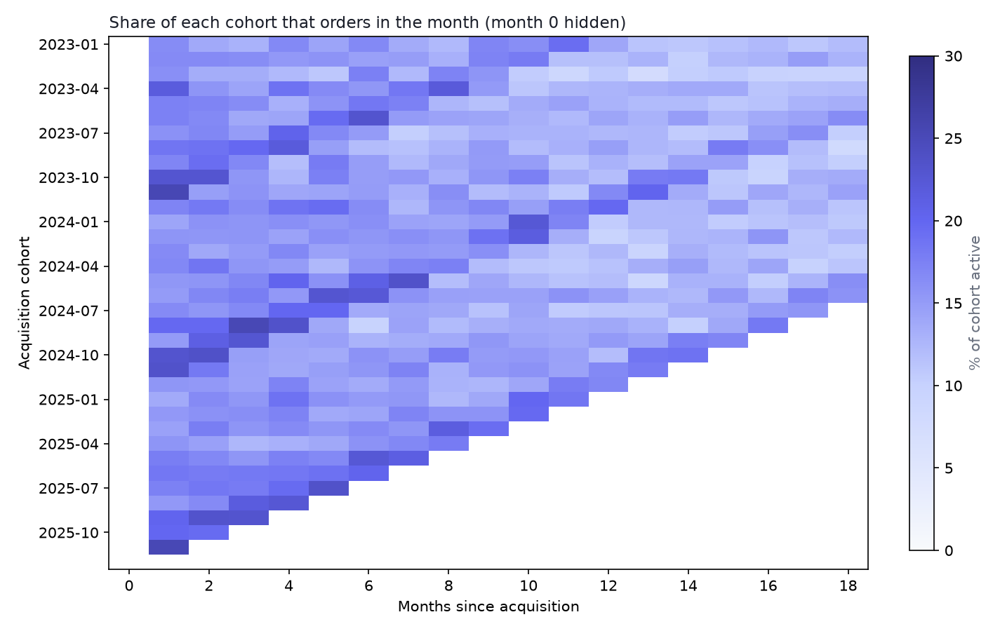
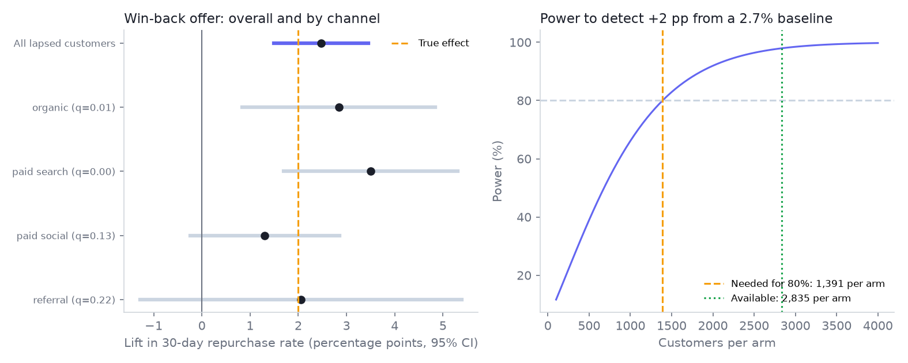

# Customer Lifecycle, Retention and Experimentation Lab

**Who are the customers, who is about to leave, what are they worth, and did the win-back offer actually work?**
This project takes a simulated repeat-purchase business from raw orders to decisions: RFM and cluster segmentation, cohort retention, churn and value models tested on a *later* time period, a revenue forecast, and a complete A/B testing toolkit whose statistics are themselves tested by simulation.

> **Read this first: the data is simulated.**
> 17,550 customers and 66,884 orders are generated from a seeded model with four hidden behavioural segments, so every method can be checked against a known truth. The win-back experiment's treatment effect is injected by the simulator. Everything here shows how the methods behave, not how any real business performs. Nothing is employer or customer data.



## What I found (seed 21)

| Question | Answer |
|---|---|
| Where does the revenue come from? | **Champions are 23% of customers but 54% of revenue to date**, and 57% of them buy again within 90 days. Hibernating customers (23% of the base) buy again 5% of the time |
| Can clustering recover the hidden segments? | **Only weakly** (adjusted Rand index 0.13). Frequency and spend overlap between segments, so RFM clusters describe *behaviour tiers*, not the underlying types. Reported as found, not tuned away |
| How fast do customers leave? | Share of a cohort ordering in a month: 18% at month 1, 13% at month 12, 10% at month 24 |
| Can we predict churn? | Trained on the 2024-06-30 snapshot and **tested on 2025-06-30**: AUC **0.70** (logistic regression) and **0.69** (tuned gradient boosting). The riskiest decile churns at 80% against 57% overall. The simple model is as good as the complex one |
| Can we predict value? | Beats a run-rate baseline: MAE **59 vs 90**; the top decile of predicted value captures **44%** of next-six-month revenue against 35% |
| Can we forecast revenue? | Holt-Winters with six months held out: **1.9% MAPE** against 17.3% for a naive forecast |
| Did the win-back offer work? | Lift of **+2.47 pp** in 30-day repurchase (95% CI 1.49 to 3.45, p < 0.001; the injected true effect is +2.0 pp). Revenue per customer **+0.97** (95% CI 0.31 to 1.62). Two of four channels show a lift on their own, but a formal interaction test finds **no evidence the effect differs by channel** (p = 0.51) |



### Does the testing method itself work?

Statistics code can be wrong in quiet ways, so the toolkit is validated by running 4,000 simulated experiments:

| Check | Target | Result |
|---|---:|---:|
| False positives on A/A tests | 5% | 5.1% |
| Coverage of 95% intervals | 95% | 95.2% |
| Power: simulation vs formula | match | 98.5% vs 97.9% |

Unit tests additionally compare the sample-size formula, z test, Welch test, Benjamini-Hochberg correction and CUPED against statsmodels, scipy and closed forms.



Honest notes from the experiment: planning needed 1,391 customers per arm for 80% power and 2,835 were available (98% power). **CUPED barely helped (0.2% variance reduction)** because a lapsed customer's past spend says little about a 30-day outcome. The method is correct (tests confirm it recovers variance reduction of about rho squared when the covariate is informative); it just is not useful for this metric.

The full report with every chart and table is [`reports/report.html`](reports/report.html) (self-contained).

## What is in the box

| Path | What it does |
|---|---|
| `src/lifecycle_lab/simulate.py` | Seeded world: four hidden segments, monthly acquisition for 36 months, seasonality, dropout |
| `src/lifecycle_lab/features.py` | **Point-in-time** features and future outcomes (tests prove no look-ahead leakage) |
| `src/lifecycle_lab/rfm.py` | Quintile RFM scores, rule-based segments, k-means with silhouette selection |
| `src/lifecycle_lab/cohorts.py` + `sql/cohort_retention.sql` | Cohort retention in pandas and in SQL; a test requires them to agree exactly |
| `src/lifecycle_lab/predict.py` | Churn (logistic regression and tuned gradient boosting) and six-month value model, **trained on one snapshot and tested on a later one** |
| `src/lifecycle_lab/forecast.py` | Holt-Winters back-test against naive and seasonal-naive baselines |
| `src/lifecycle_lab/experiment.py` | Sample size and power, MDE, z and Welch tests, CUPED, sample-ratio-mismatch check, Bayesian read-out, Benjamini-Hochberg, interaction test, Monte Carlo self-validation |
| `bi/` | CSV extracts plus Power BI (DAX) and Tableau definitions |
| `docs/` | [Method](docs/method.md) and [KPI definitions](docs/kpi_definitions.md) |
| `tests/` | 35 tests |

## Run it

```bash
python -m venv .venv && source .venv/bin/activate
pip install -r requirements.txt
PYTHONPATH=src python -m lifecycle_lab run     # about 20 seconds; writes reports/ and bi/data/
pytest                                          # 35 tests
```

## Limitations

* Simulated customers follow simple purchase processes; real behaviour has promotions, stock-outs, returns and channel effects that this does not.
* The experiment's treatment effect is injected, so the "true" lift is known in advance. Real experiments never offer that.
* The forecast is accurate partly because the synthetic series is smooth.
* One seed is one draw. Different seeds shift individual numbers; the qualitative findings come from the design.

## Skills this project demonstrates

SQL (joins, date arithmetic, reconciliation with pandas), Python, Pandas, NumPy, scikit-learn (classification, regression, clustering), statistical analysis, A/B test design and analysis, forecasting, cohort and lifecycle analytics, segmentation, predictive modelling without data leakage, and BI-ready data modelling.
